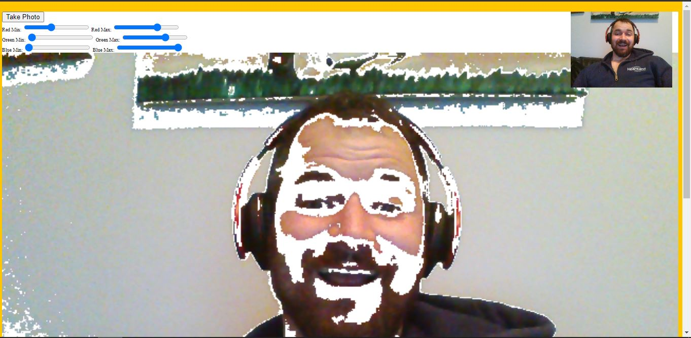

# UnrealWebcam

This is project 19 in Wes Bos' JavaScript 30 course.  In this lesson we built a custom webcam that allows users to take pictures of themselves, add filters, then save the pictures onto their hard drive.  This project used mostly JavaScript, HTML and CSS, however it did require using Node.js and MAMP for a secure origin otherwise the browser wouldn't allow webcam access. 

 One problem I encountered doing the lesson was, the tutorial uses video.src which has since been outdated in browsers, I was able to find an updated solution: video.srcObject, a simple fix but still required looking on Stack Overflow to find the answer.  This was a really fun lesson, if you're interested in doing the project yourself, you can find the video <a href="https://www.youtube.com/watch?v=ElWFcBlVk-o">here.</a>

